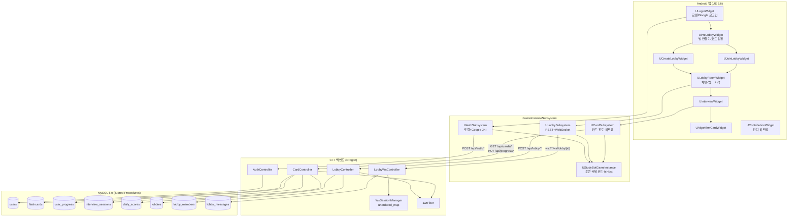
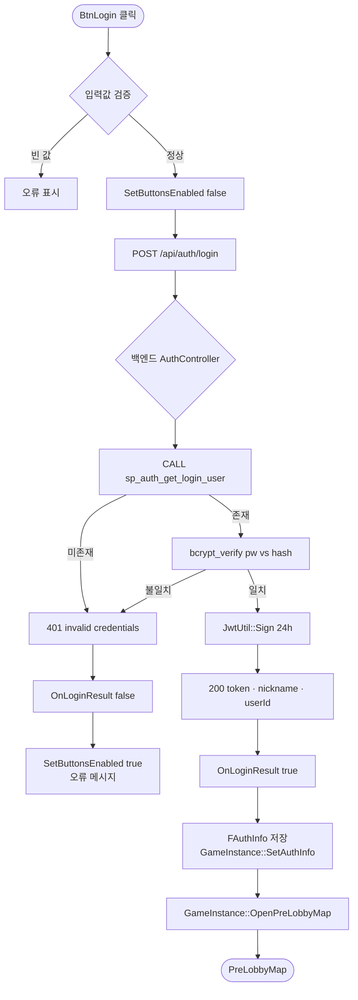
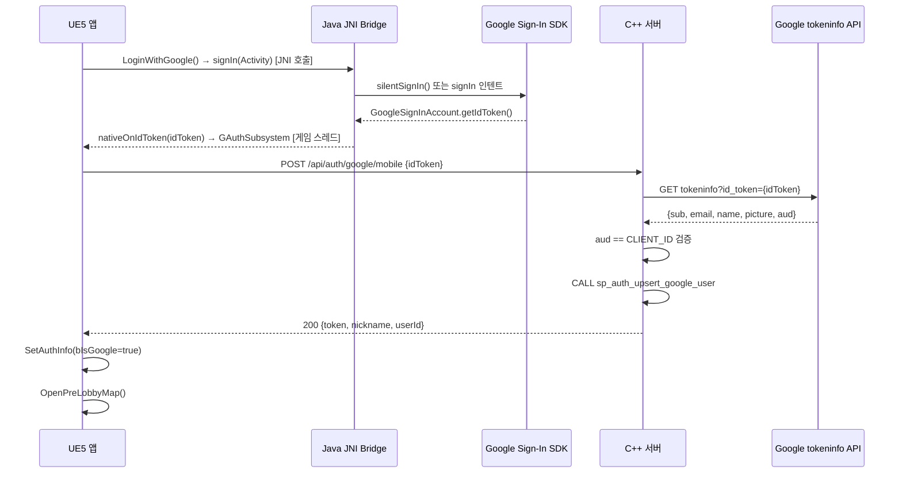
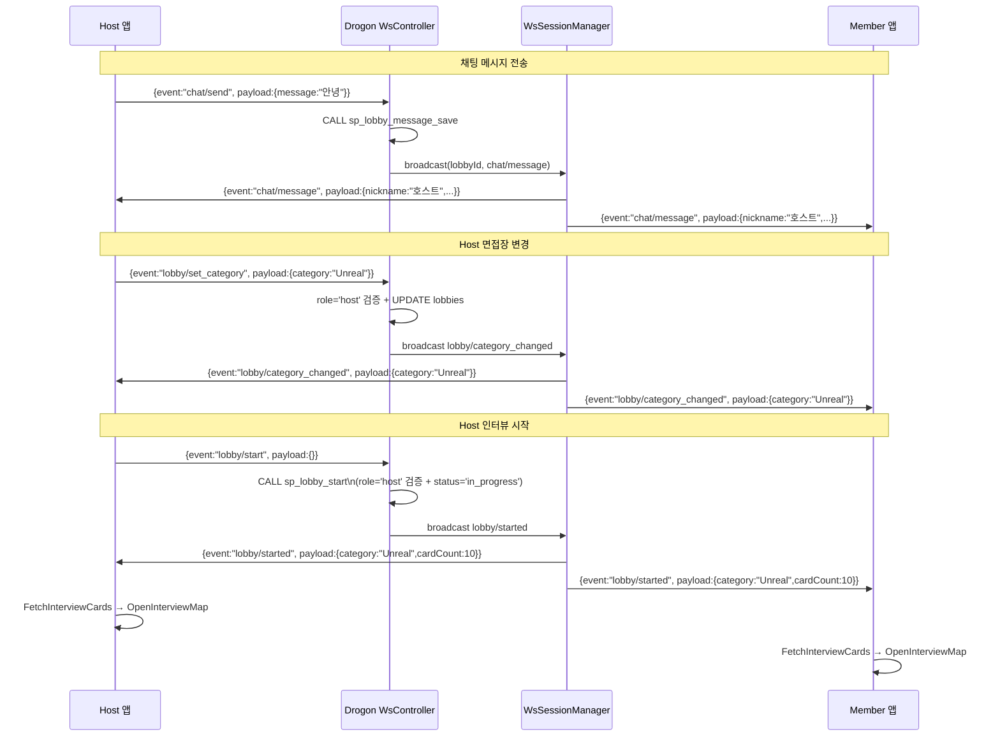
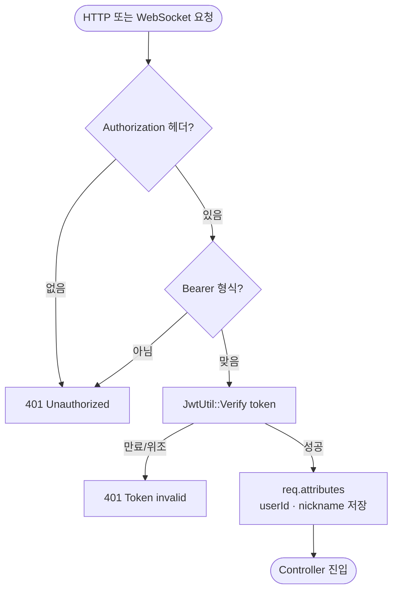
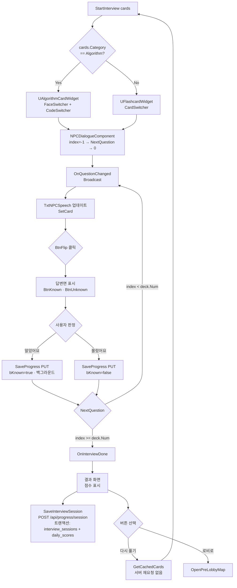
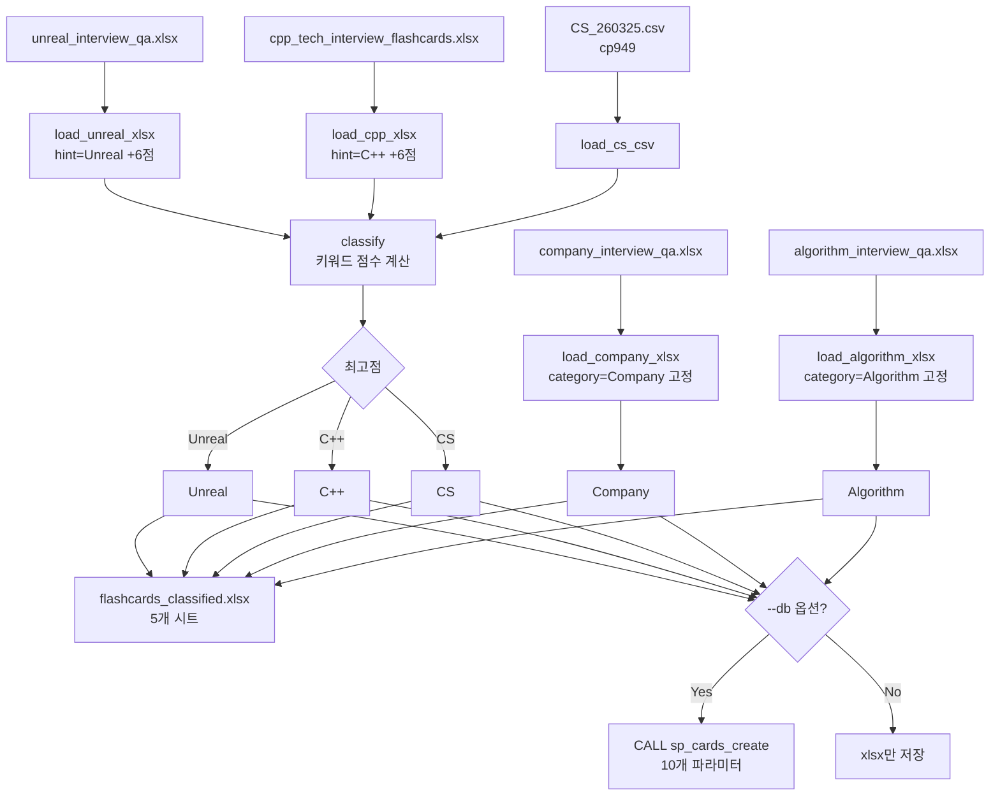
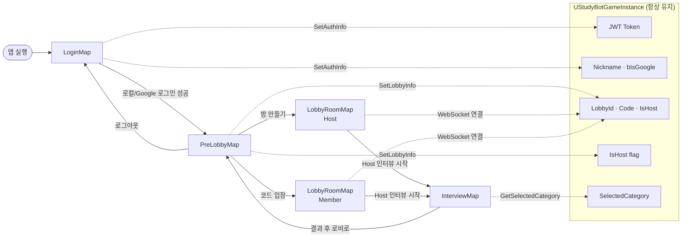
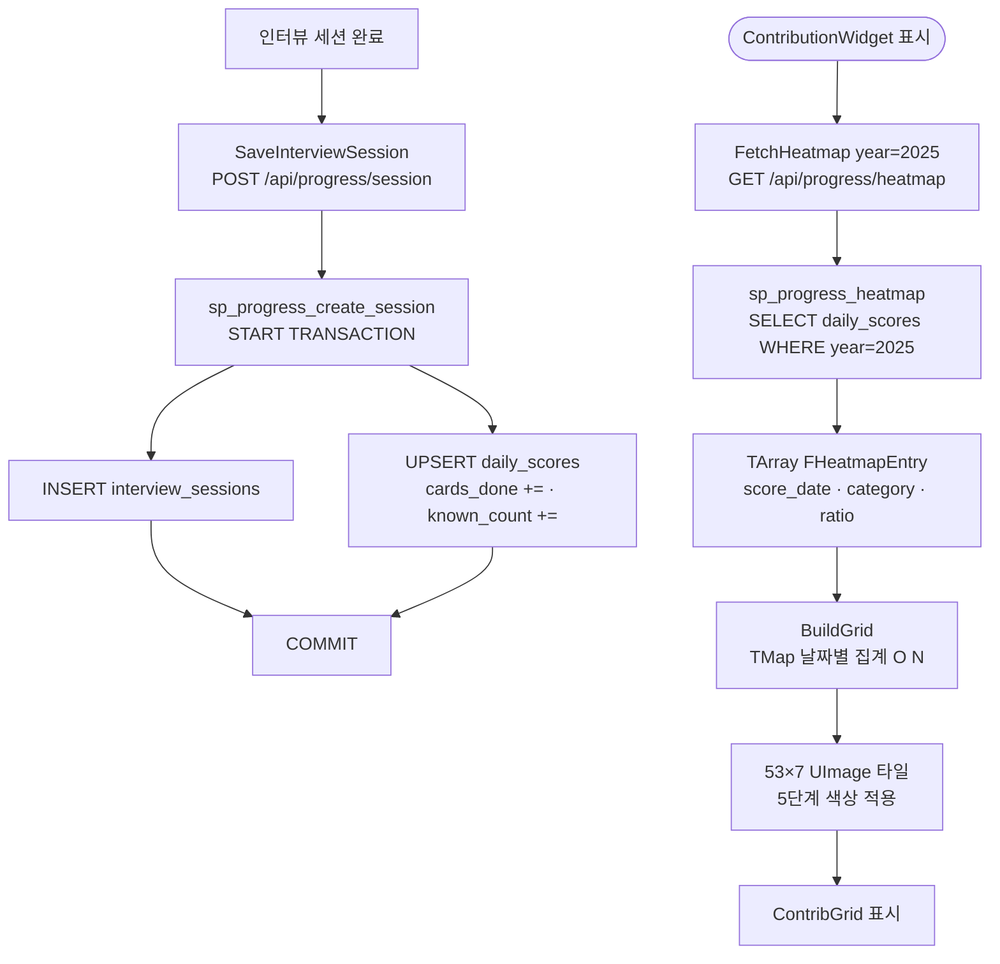
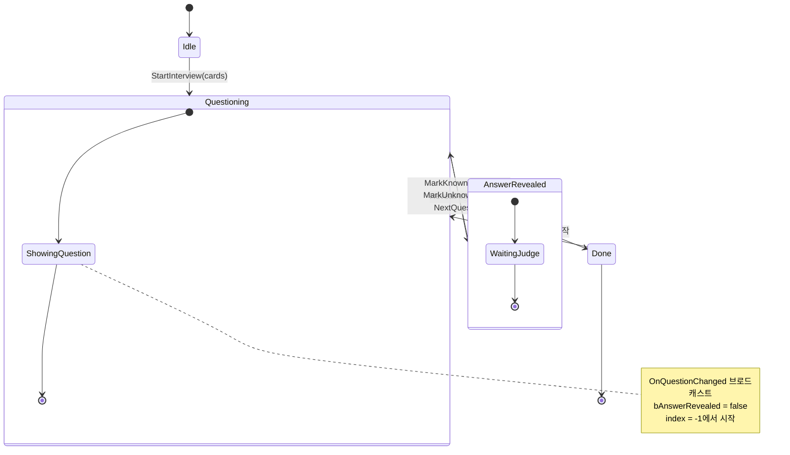

# 06. Flowcharts (Mermaid) — v3

> GitHub / VS Code Markdown Preview Enhanced / Notion 에서 렌더링됩니다.

---

## 1. 시스템 전체 구조 (v3)



---

## 2. 로컬 로그인 → PreLobby 흐름



---

## 3. Google 로그인 흐름 (JNI)



---

## 4. 로비 생성 → WebSocket 연결

```mermaid
flowchart TD
    A([BtnCreate 클릭]) --> B[입력값 검증\n이름·카테고리 확인]
    B --> C[POST /api/lobby\n{name, category, maxMembers}]

    C --> D{LobbyController}
    D --> E[JwtFilter: userId 추출]
    E --> F[category 화이트리스트 검증]
    F --> G[generateLobbyCode: 6자리]
    G --> H[CALL sp_lobby_create\nINSERT lobbies + lobby_members host]
    H --> I[201 {lobbyId, code, name, category}]

    I --> J[FLobbyInfo 파싱]
    J --> K[GameInstance::SetLobbyInfo\nbHost=true]
    K --> L[ConnectWebSocket\nws://server/ws/lobby/1?token=JWT]

    L --> M{JwtFilter WebSocket}
    M -- 검증 실패 --> N[연결 거부]
    M -- 검증 성공 --> O[WsSessionManager::addSession]
    O --> P[OnLobbyCreated.Broadcast]
    P --> Q([LobbyRoomMap — Host])
```

---

## 5. 로비 코드 입장 흐름

```mermaid
flowchart TD
    A([InputCode 입력 → BtnJoin]) --> B[POST /api/lobby/join\n{code:"ABC123"}]

    B --> C{LobbyController::joinLobby}
    C --> D[CALL sp_lobby_join\ncode 검색]
    D --> E{유효성 검사}
    E -- LOBBY_NOT_FOUND --> F[404 오류]
    E -- LOBBY_NOT_WAITING --> G[400 오류]
    E -- LOBBY_FULL --> H[409 오류]
    E -- 입장 가능 --> I[INSERT lobby_members\nrole='member']

    I --> J[200 {lobbyId, members:[...]}]
    J --> K[FLobbyInfo 파싱\nbHost=false]
    K --> L[ConnectWebSocket\nws://server/ws/lobby/1]
    L --> M[WsSessionManager::addSession]
    M --> N[broadcastExcept member/joined\n→ 기존 멤버들에게]
    N --> O[OnLobbyJoined.Broadcast]
    O --> P([LobbyRoomMap — Member])

    F & G & H --> Q[OnLobbyError.Broadcast\n오류 메시지 표시]
```

---

## 6. WebSocket 이벤트 흐름 (로비 내)



---

## 7. 멤버 강퇴 흐름

```mermaid
flowchart TD
    A([Host BtnKick 클릭\ntargetUserId=3]) --> B[POST /api/lobby/1/kick\n{targetUserId:3}]
    B --> C{LobbyController::kickMember}
    C --> D[CALL sp_lobby_kick\nhostId·lobbyId·targetId]
    D --> E{role='host' 검증}
    E -- NOT_HOST --> F[403 오류 응답]
    E -- 확인됨 --> G[DELETE lobby_members\nWHERE user_id=3]
    G --> H[200 {message}]
    H --> I[LobbyService → WSM::broadcast\nmember/kicked payload={userId:3}]

    I --> J{각 클라이언트 수신}
    J -- userId==자신 --> K[강퇴됨 메시지\n→ OpenPreLobbyMap]
    J -- 다른 멤버 --> L[m_memberMap.Remove\n→ RefreshMemberList]
```

---

## 8. JWT 인증 미들웨어 흐름



---

## 9. 인터뷰 세션 흐름



---

## 10. 카드 데이터 파이프라인 (import_cards.py)



---

## 11. 씬(맵) 전환 전체 흐름 (v3)



---

## 12. 잔디 히트맵 데이터 흐름



---

## 13. NPCDialogueComponent 상태 머신


